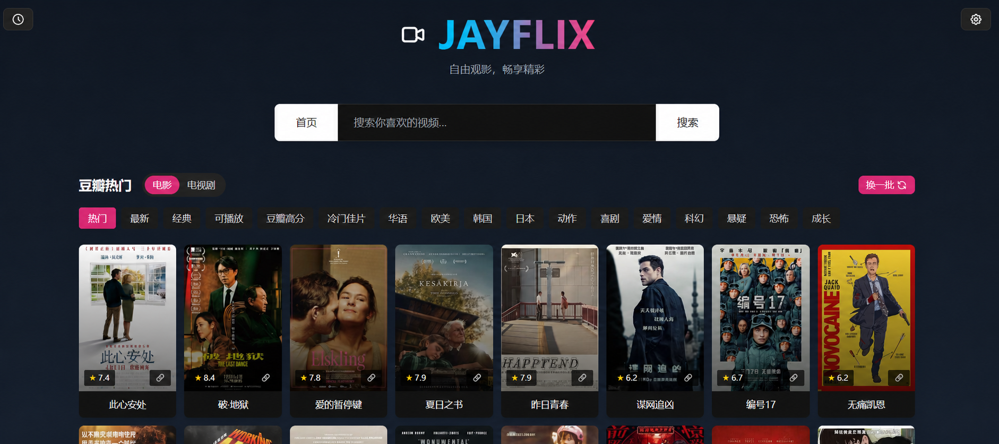

# JAYFLIX

<div align="center">
  
  <p>轻量级、多源在线视频搜索与播放前端</p>
</div>



## 项目简介

JAYFLIX 聚合兼容苹果 CMS V10 格式的第三方视频接口，提供多源搜索、详情展示与 HLS 播放。项目不提供、不存储、不上传任何视频内容。

本项目由 [LibreSpark/LibreTV](https://github.com/LibreSpark/LibreTV) 衍生维护；其上游基于 [bestK/tv](https://github.com/bestK/tv) 重构。

## 主要功能

- 多数据源并行搜索与自定义接口
- 豆瓣电影、电视剧推荐
- HLS 播放、选集、自动连播与播放进度恢复
- 观看历史、搜索历史及配置导入导出
- 桌面端和移动端响应式界面
- 可选的访问密码与设置密码

## 本地运行

要求 Node.js 18 或更高版本。

```bash
npm install
npm start
```

默认访问地址：`http://localhost:8080`

开发模式：

```bash
npm run dev
```

## 环境变量

| 变量 | 默认值 | 说明 |
| --- | --- | --- |
| `PORT` | `8080` | Node 服务端口 |
| `PASSWORD` | 空 | 站点访问密码 |
| `ADMINPASSWORD` | 空 | 设置面板密码；Netlify 当前仅注入 `PASSWORD` |
| `CORS_ORIGIN` | `*` | Node 代理允许的来源 |
| `REQUEST_TIMEOUT` | `5000` | Node 代理请求超时，单位为毫秒 |
| `MAX_RETRIES` | `2` | Node 代理失败重试次数 |
| `DEBUG` | `false` | 调试日志开关 |

可在项目根目录创建 `.env`：

```dotenv
PORT=8080
PASSWORD=replace_with_a_strong_password
ADMINPASSWORD=replace_with_an_admin_password
```

## Docker

```bash
PASSWORD='replace_with_a_strong_password' docker compose up -d --build
```

服务默认映射到 `http://localhost:8899`。请务必覆盖 Compose 文件中的默认密码。

## 平台部署

仓库包含以下平台配置：

| 平台 | 配置入口 |
| --- | --- |
| Vercel | `vercel.json`、`middleware.js`、`api/` |
| Cloudflare Pages | `functions/` |
| Netlify | `netlify.toml`、`netlify/` |
| Render | `render.yaml`、`server.mjs` |
| Docker | `Dockerfile`、`docker-compose.yml` |

导入仓库后按平台配置部署，并在平台控制台设置 `PASSWORD`。本项目依赖服务端代理，不能仅使用普通静态文件服务器运行完整功能。

## 自定义接口

在设置面板中添加兼容苹果 CMS V10 的接口基础地址，例如：

```text
https://example.com/api.php/provide/vod
```

接口应支持：

```text
GET {base}?ac=videolist&wd={keyword}
GET {base}?ac=videolist&ids={id}
```

## 播放器快捷键

| 按键 | 功能 |
| --- | --- |
| `Space` | 播放或暂停 |
| `←` / `→` | 快退或快进 5 秒 |
| `↑` / `↓` | 调整音量 |
| `Alt` + `←` / `→` | 上一集或下一集 |
| `F` | 切换全屏 |

## 技术栈

HTML、CSS、JavaScript、Tailwind CSS、ArtPlayer、Hls.js、Express 5、Serverless Functions、localStorage。

## 安全与使用说明

- 建议仅限个人、非公开部署，并设置强密码。
- 当前密码验证主要在浏览器端完成，不能替代平台级身份认证或网络访问控制。
- 内置代理会访问用户配置的第三方地址，请勿将实例作为公共代理开放。
- 使用者应自行确认第三方接口及内容符合所在地法律和授权要求。

## 许可证

本项目采用 [Apache License 2.0](LICENSE)。
